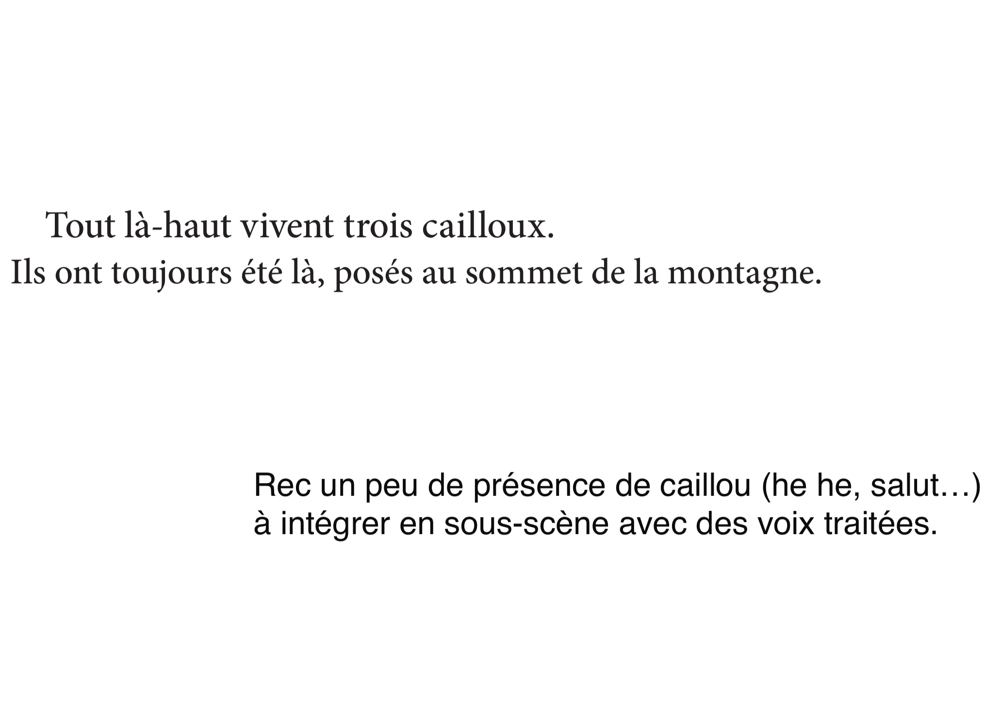
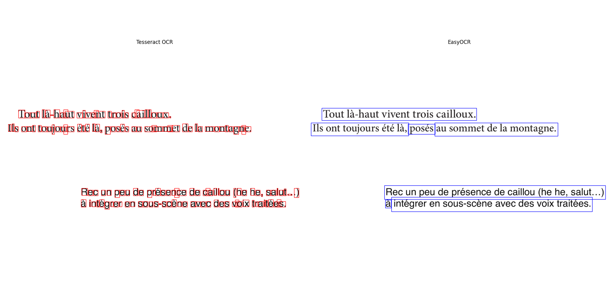
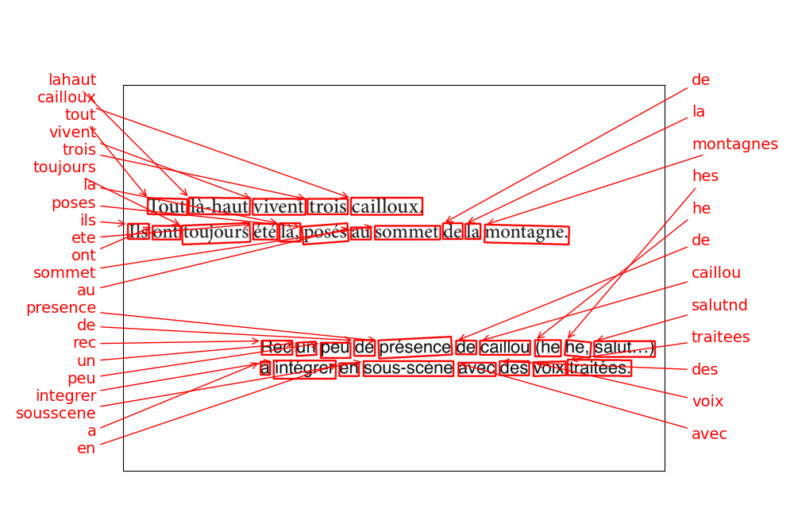
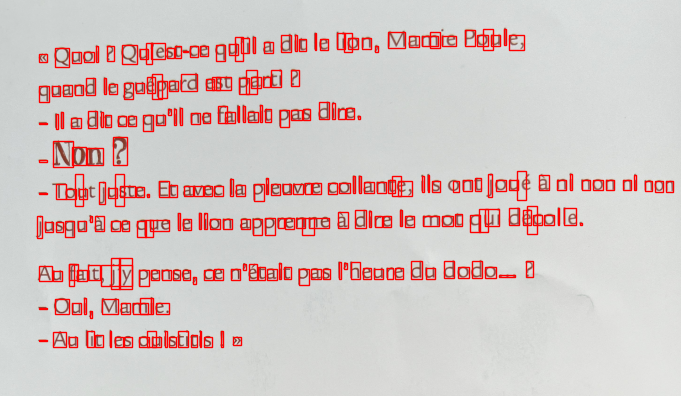
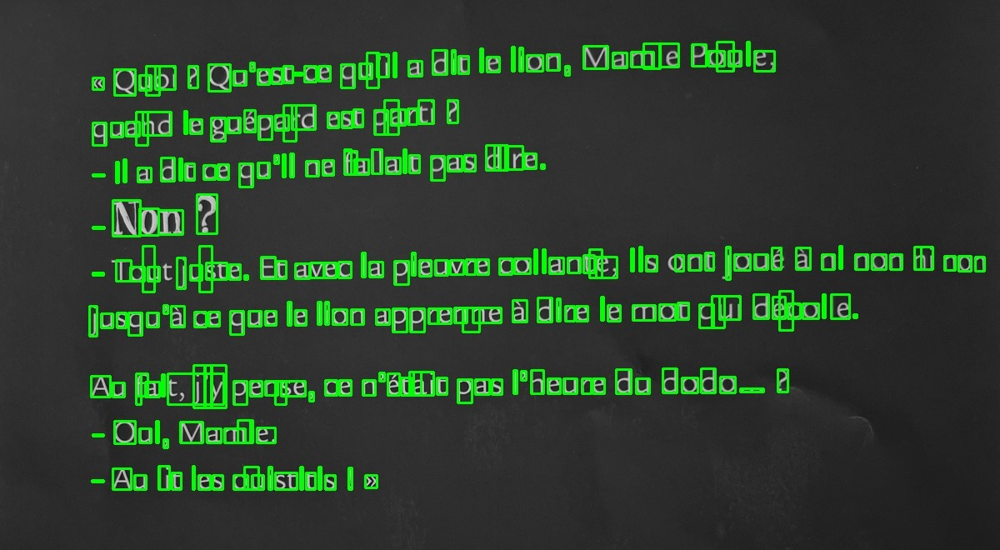

# OCR Process and Optimization for Vocabulo Junior

## Overview

Optical Character Recognition (OCR) is a crucial technology for Vocabulo Junior. OCR is used to convert the text of 
children's books into usable digital data, enabling interaction between the physical content of the books and the 
application's digital functions. This document details my process of selecting, optimising and fine-tuning an OCR engine
tailored to the specificities of children's books, ensuring accurate text recognition despite the unique challenges 
presented by these books.

## OCR Engine Comparison

I evaluated three OCR engines:

1. EasyOCR :
   * Strengths:
        - Pre-trained for 80+ languages (including French).
        - Fast and lightweight, with easy integration using a simple API.
        - Provides robust results on diverse fonts and text styles, making it effective for noisy backgrounds.
   * Weaknesses:
     - Not as fine-tuned for complex documents (e.g., dense text).
     - Limited ability to detect non-standard text layouts (e.g., tables, columns).
     - Performance can be suboptimal on large, high-resolution documents compared to other tools.

2. Tesseract: 
   * Strengths:
        - One of the most mature and widely-used OCR engines, supported by Google.
        - Works well on high-quality scanned documents and text-heavy images.
        - Strong support for structured text extraction with features like hOCR for layout parsing ( hOCR outputs OCR 
results in an XHTML format: with text recognition data, layout structure, bounding boxes for text regions, and 
character confidence scores)
   * Weaknesses:
        - Slower processing speed, especially on large datasets.
        - Accuracy can degrade significantly with low-quality images or complex fonts.
        - Requires careful pre-processing to achieve high accuracy.
    
3. Keras OCR:
   * Strengths:
        - Built on deep learning models (using Keras), offering state-of-the-art accuracy for text detection and recognition.
        - Handles complex images, multiple orientations, and irregular layouts well.
        - Provides end-to-end OCR capability, which simplifies the integration process.
     * Weaknesses:
        - Requires a significant amount of computational power and is slower than lighter OCR systems like EasyOCR.
        - Limited language support compared to Tesseract and EasyOCR.
        - The installation and dependencies are more complex, requiring a deep learning environment.

The comparison focused on:
- Accuracy in extracting text from various book layouts
- Performance with different fonts, including handwritten text
- Ability to handle images with complex backgrounds
- Processing speed

### First test: EasyOCR and Tesseract

Inspired by the literature and tutorials I consulted online, I wrote an initial processing 
[script](../src/ocr/OCR_1_easyOCR_Tesseract.py) using EasyOCR and Tesseract comprising several preprocessing steps, such
as deskewing (correcting image tilt) and converting images to grayscale, with the goal of improving text detection accuracy. 
And I computed the skew angle and applied a deskewing transformation to enhance OCR performance if the photo is not well
taken.

However, through my experiments, I found that these preprocessing steps, while theoretically useful, didn't yield 
significant improvements in detection quality. This was mainly because the backgrounds in children's books, where the 
text is often surrounded by colorful or complex illustrations, made it challenging for OCR algorithms to isolate and 
accurately detect the text.

Based on this realization, I shifted the focus from intensive image preprocessing to a more user-centric solution. Instead
of relying heavily on deskewing and other corrections, I implemented a guiding frame in app. This frame helps users 
correctly align their camera when taking photos of text, thus ensuring the images are properly angled from the start. 
By addressing the issue at the image capture stage, I managed to bypass many of the limitations posed by complex 
backgrounds, which weren't significantly improved through standard preprocessing techniques.

In addition to the problems with kewing, the models had a lot of trouble when the page was taken as a whole with several
blocks of text sometimes aligned horizontally. The template detected paragraphs by their height and tended to mix up the
lines. 

In addition, whole pages with illustrations fooled the OCR, which detected characters in the illustration images

**CONCLUSION:**
Preprocessing of the dataset became necessary: the images had to contain only a single paragraph of text (or more, but 
vertically on the page, not horizontally) 
The entire dataset was reprocessed to ensure that, instead of processing 
entire pages, it focused on individual text paragraphs (blocks) and minimize presence of illustration.

### Second test: EasyOCR, Tesseract

I pass the same 2 models on all prepared images. I give you an example on one picture with 2 paragraph.

#### Example of comparison on 1 image 
This is the input image :


I first wrote a [script](../src/ocr/OCR_2_esayOCR_Tesseract.py) to run easyOcr and Tesseract on the images to generate
the extracted text and the boxes corresponding to the characters or words found.


The image displays the outputs from Tesseract OCR on the left and EasyOCR on the right, both working on the same text 
image. The text in question is from a children's book, containing multiple paragraphs.

**EasyOCR** (right): 
```
Tout là-haut vivent trois cailloux. Ils ont toujours été là au sommet de la montagne. Rec un peu de présence de caillou (he he, salut.. ) à intégrer en sous-scène avec des voix traitées. posés
```
* Accuracy: EasyOCR performed quite well, correctly identifying almost all of the text. The majority of words are 
accurate, with only a minor issue where the word "posés" appears at the end, which seems out of place.
* Structure: EasyOCR maintained the structure of the text quite well, preserving the paragraph spacing.
* Errors: Only a slight misplacement of the word "posés" and the ellipsis punctuation with "salut..".
* Overall: EasyOCR shows a strong ability to recognize text with minimal distortion, and the result is mostly clean 
and readable.

**Tesseract OCR** (left):
```
Tout là-haut vivent trois cailloux.
Ils ont toujours été là, posés au sommet de la montagne.

Rec un peu de présence de caillou (he he, salut…)
à intégrer en sous-scène avec des voix traitées.

```

* Accuracy: Tesseract also did fairly well in recognizing the text. There are no major spelling mistakes or 
misrecognized characters, and the punctuation is well-handled.
* Structure: Tesseract preserved the structure with good paragraph breaks and spacing. The output is almost identical
to the original text.
* Errors: Minimal, the recognition here is solid, but a slight issue in the overall formatting when compared to EasyOCR.
* Overall: Tesseract gives a very close match to the source material, with good text alignment and accurate word 
recognition.

#### Comparison

```python
def calculate_confidence(text1, text2):
    """
    Calculates a confidence score based on the similarity of two texts using the Jaccard similarity coefficient.

    Parameters:
    text1 (str): The first text to compare
    text2 (str): The second text to compare

    Returns:
    float: The Jaccard similarity coefficient, representing the confidence score
    """
    # Convert texts to lowercase and split into words
    words1 = set(text1.lower().split())
    words2 = set(text2.lower().split())

    # Calculate the intersection and union of the word sets
    intersection = words1.intersection(words2)
    union = words1.union(words2)

    # Compute the Jaccard similarity coefficient
    jaccard_similarity = len(intersection) / len(union)

    return jaccard_similarity
```

If we calculate a `Confidence score` between the Tesseract and easyOcr results for this image, we still get 0.86, which 
is a good result.
This score is not a perfect match for all images. 
Some texts are better extracted by easyOCR, others by Tesseract. Some Tesseract text cannot be found at all, whereas 
easyOCR detects certain words (particularly when the text is white on a very colourful and busy background). You can view
a small overview of [ScoreConfidence](../reports/ocr_performance/ScoreConfidence_Tess_EasyOcr.png) .

There are few resources available for finetuned easyOCR, apart from adaptations for reading characters in images 
(such as number plates, shop fronts on an image, etc.).
Tesseract, on the other hand, is more easily finetuned with python via pytesseract.

Before choosing what I was going to apply, I also tried using another type of OCR, but it was likely to be more difficult
to use for a mobile application because of its demand on resources.

### Third test: Keras

I wrote a [script](../src/ocr/OCR_Keras.py) to run Keras on the same images as previous test to extracted text 
and the boxes corresponding to the characters or words found.

#### Example of on the same previous image



Extract text :
```
lahaut cailloux tout vivent trois la de ils ete la toujours poses ont sommet montagnes au presence rec de de caillou he hes salutnd un peu traitees integrer sousscene des a voix avec en
```

* Accuracy: KerasOCR struggled significantly compared to the other two systems. Many words are incomplete or scrambled, with misplaced characters and incorrect word order. For example, "salutnd" instead of "salut", and "lahaut" instead of "Tout là-haut".
* Structure: The structure of the paragraphs is not preserved at all. The text is crammed into a single block, making it difficult to read.
* Errors: Many errors in both word recognition and sentence structure. KerasOCR failed to accurately capture most of the text, leading to a jumbled and unclear output.
* Overall: KerasOCR's performance is the weakest, with significant issues in both text accuracy and layout preservation.

** CONCLUION: **
After thorough testing, Tesseract was selected due to its superior performance and customization capabilities.

## Tesseract Fine-Tuning Process

### Flowchart 



### 1. Dataset Collection

- Collected approximately 500 images from children's books
- Dataset includes:
  - Various fonts (including handwritten)
  - Images with and without background illustrations
  - Text in different colors (black, white, and colored text)
- Convert images in TIF (Tagged Image File Format) format : most format suitable for OCR processing because it preserves
the fine details of the characters, which are essential for accurate recognition
- Drafting of the corresponding 'Ground truth' text file containing the expected text

### 2. Prepare Training Data

Generate corresponding BOX files from each TIF Images which contain the exact transcription of the text present in each
image and specify the coordinates of each character within the TIF image, helping the model learn the association between
the image and the text.
In the BOX file, Each line of a BOX file represents a character in the corresponding image and contains the following 
information:
- The character itself
- The x and y coordinates of the lower left corner of the box enclosing the character
- The x and y coordinates of the top right-hand corner of the same box
- The page number (usually 0 for individual images)

For example : `T 287 1223 305 1245 0`
This means that the character ‘T’ is located in a rectangle with the bottom left corner at coordinates (287,1223) and 
the top right corner at coordinates (305,1245).

During fine-tuning, Tesseract uses these BOX files to :
- Learn the exact correspondence between the visual appearance of a character and its textual representation.
- Understand the spatial layout of characters in different contexts.
- Improve your ability to segment text correctly, particularly in complex layouts.

The use of BOX files thus enables precise supervised learning, where the model can compare its predictions with the 
exact positions and identities of the characters in each training image.

### 3. Generate LSTMF Files

Using Tesseract with Page Segmentation Mode (PSM) 6, I generated LSTMF files. These files are the serialized form of the
images and their corresponding ground truth (from the BOX files), prepared for training the LSTM model in Tesseract.


Command:
```bash
tesseract input_image.tif output_base -l fra --psm 6
```

### 4. Extract Existing LSTM Model

I extracted the LSTM model from Tesseract's pre-trained model using the `combine_tessdata -e` command. This command 
isolates the LSTM component of the existing language model, allowing me to continue training from that point rather than
starting from scratch. 

Command:
```bash
combine_tessdata -e fra.traineddata fra.lstm
```

The file `fra.traineddata` contains the language specific features learned from prior training. I use this to fine-tuned
with my custom dataset.

### 5. Train the Model

The `lstmtraining` command was used to perform the actual training of the LSTM model using my images and BOX files. Here,
I used the train_files.txt file to list all the training data (the LSTMF files), and I specified the number of iterations
(epochs) for the training. This is the core step of the fine-tuning process.

Command:
```bash
lstmtraining  
              --model_output fra_new.lstm
              --continue_from fra.lstm 
              --traineddata fra.traineddata 
              --train_listfile train_files.txt 
              --max_iterations 1000 
              --debug_interval 0 
              --learning_rate 0.001 
              --perfect_sample_delay 4
```

The initial parameters for fine-tuning were chosen based on best practice and the recommendations in the Tesseract 
documentation:
* Initial `learning rate` of 0.001: This moderate rate allows the model to adapt to the new data without diverging too 
quickly from the pre-trained model.
* 1000 initial `iterations`: This number offers a good balance between training time and improvement potential, 
allowing an initial assessment of the model's performance.
* `perfect_sample_delay` of 4: This value allows the model to adapt gradually, avoiding too abrupt changes that could 
destabilise the training.

#### Training Process

1. **Initial Test**:
   - 1000 iterations
   - Results: BCER (Best Character Error Rate) of 76.798%, BWER (Best Word Error Rate) of 100%

2. **Increased Iterations**:
   - 5000 iterations
   - Results: BCER improved to 70.41%, BWER to 86.2%

3. **Final Training**:
   - 15000 iterations
   - Results: BCER of 15.729%, BWER of 67.600%

#### Optimization Steps
Throughout the training process, I monitored the BCER (Character Error Rate) and BWER (Word Error Rate) to adjust the 
training parameters for better results :

1. Increasing the number of iterations: Continuing the training for more epochs to improve model accuracy.
2. Adjusting the learning rate: A lower learning rate (like 0.0001) helps the model to fine-tune more gradually and 
avoid drastic changes that could destabilize the training process
   - Reduced from 0.001 to 0.0001, then to 0.00005
3. Modifying the `perfect_sample_delay`: This parameter controls how long the model waits between iterations with no 
improvement before adjusting its learning strategy. By increasing this value (e.g., to 8), I gave the model more time 
to stabilize before making changes.
4. Change and used PSM 3 (fully automatic page segmentation) mode when generating LSTMF files

#### Final Results

- Best Character Error Rate (BCER): 15.729%
- Best Word Error Rate (BWER): 67.600%

These results show significant improvement over the base model, particularly in character recognition.

### 6. Convert Final Model

After reaching a satisfactory training outcome, I used the `combine_tessdata` command to combine my fine-tuned LSTM model
with original Tesseract resources into a new .traineddata file, ready to be used in Tesseract for OCR.

Command:
```bash
combine_tessdata -e fra.traineddata fra_new.lstm
```

## Implementation

The trained LSTM model was converted into a `.traineddata` file using the `combine_tessdata` tool, allowing it to be used 
directly by Tesseract in the Vocabulo Junior application.

## Challenges Faced

1. LSTMF file generation issues due to Windows text encoding for the 'Ground truth' file
2. Difficulty extracting the LSTM model from Tesseract due to version incompatibilities
3. Script execution problems, resolved by using command-line operations
4. Persistently high BWER, indicating room for further improvement in word recognition
5. Would require more time and much more data to make the model more effective

## Future Improvements

1. Expand the training dataset with more diverse children's book samples
2. Experiment with data augmentation techniques to improve generalization
3. Investigate methods to specifically target and reduce the BWER

## BEFORE-AFTER results
<div style="display: flex; justify-content: space-between;">
    <figure style="width: 48%;">
    
    <figcaption>Original Tesseract OCR</figcaption>
  </figure>
  <figure style="width: 48%;">
    
    <figcaption>Finetuned Tesseract OCR</figcaption>
  </figure>
</div>

TEXT BEFORE :
```
i ? Qu'est-ce qu’il a dit le lion, Mamie Poule,

« Quo
quand le guépard est parti ?

- Il a dit ce qu’il ne fallait pas dire.
-Non ?

- Tout juste. Et avec la pieuvre collante, ils ont joué à ni non ni non

jusqu’à ce que le lion apprenne à dire le mot qui décolle.

Au fait, jy pense, ce n’était pas l’heure du dodo. ?

- Oui, Mamie.

- Au lit les ouistitis ! »

```

TEXT AFTER :
```
 Quoi ? Qu'est-ce qu’il a dit le lion, Mamie Poule,
quand le guépard est parti ?
- Il a dit ce qu’il ne fallait pas dire.
- Non ?
- Tout juste. Et avec la pieuvre collante, ils ont joué à ni non ni non
jusqu’à ce que le lion apprenne à dire le mot qui décolle.
Au fait, j’y pense, ce n’était pas l’heure du dodo. ?
- Oui, Mamie.
- Au lit les ouistitis ! »
```


## Conclusion

The fine-tuned Tesseract model significantly improves OCR performance for children's books, providing a solid 
foundation for the Vocabulo Junior application. While character recognition has seen substantial improvement, 
ongoing work is needed to enhance word-level accuracy.