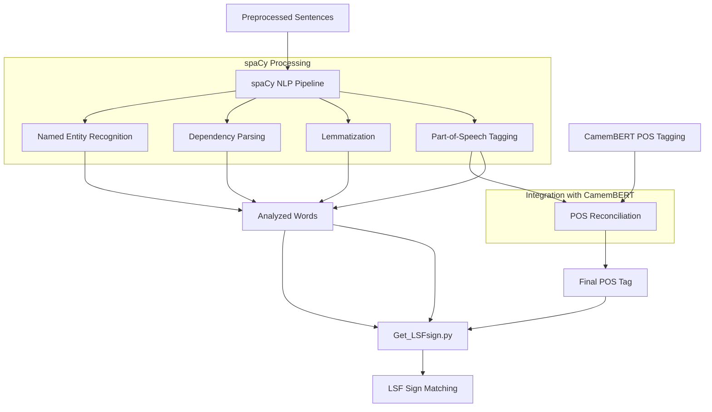

# spaCy Implementation in Vocabulo Junior

## Overview
spaCy is an advanced natural language processing library that plays a crucial role in the Vocabulo Junior project, 
particularly in the initial linguistic analysis of French text. Its primary use is within the [`Get_LSFsign.py`](../models/nlp/Get_LSFsign.py) script, 
where it aids in tokenization, part-of-speech tagging, and lemmatization.

## Process Flow Diagram


## Key Components

### 1. Model Loading
```python
nlp = spacy.load("fr_core_news_md")
```
The French language model is loaded to perform various NLP tasks. I use first the `md` model because it's a good compromise 
between the size of the model and its effectiveness on French, which is a very polysemous language and poses certain 
problems in choosing the right definition.
But in the final integration I choose `lg` model to obtain best result on real condition.

### 2. Text Analysis
```python
doc = nlp(sentence)
```
This creates a processed document object containing linguistic annotations for sentence.

### 3. Tokenization and Analysis
```python
for token in doc:
    word = token.text
    lemma = token.lemma_
    pos = token.pos_
```
Each token in the document is analyzed for its text, lemma, and part-of-speech.

### 4. Sentence Segmentation
```python
for sent in doc.sents:
    # Process each sentence
```
spaCy's sentence segmentation is used to process text sentence by sentence.

### 5. Dependency Parsing
```python
function = token.dep_
```
Dependency labels are used to determine the grammatical function of words. The grammatical function is important for 
the correct grammatical analysis of sentences, which can also be used by the user.

### 6. Context Analysis
```python
def get_context(doc, token, window=3):
    start = max(token.i - window, 0)
    end = min(token.i + window + 1, len(doc))
    return doc[start:end]
```
This function utilizes spaCy's token indexing to extract context around a given word.

## Benefits of Using spaCy

1. **Accurate Linguistic Analysis**: spaCy provides state-of-the-art accuracy in tasks like POS tagging and dependency
parsing for French.
2. **Efficient Processing**: It's designed for production use, offering fast processing even for large volumes of text.
3. **Rich Linguistic Features**: Beyond basic tokenization, it offers deep linguistic analysis that's crucial for 
understanding text structure.

## Challenges and Solutions

- **Handling Special Cases**: Custom logic is implemented in `compare_and_decide()` to handle cases where spaCy's 
analysis might need adjustment, such as for pronominal verbs or irregular verb forms.
- **Contextual Analysis**: The `get_context()` function extends spaCy's capabilities by providing a customizable window
of context around each token.

## Future Improvements

- Fine-tune the spaCy model on a corpus more representative of children's literature to improve accuracy for the 
specific domain.
- Implement more advanced use of spaCy's features, such as named entity recognition, for enhanced text understanding.

