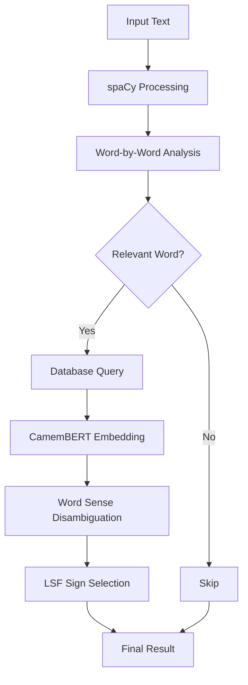

# Integration of NLP Components in Vocabulo Junior

## Overview

This document outlines how different NLP components (CamemBERT, spaCy, and custom processing) are integrated in the 
Vocabulo Junior project to achieve accurate LSF sign matching.

## Component Integration

### 1. Text Preprocessing
- OCR-extracted text is cleaned and prepared for NLP processing.

### 2. spaCy Processing
- Performs initial linguistic analysis: tokenization, POS tagging, lemmatization.

### 3. CamemBERT Embeddings
- Generates contextual embeddings for words and sentences.

### 4. Database Querying
- Retrieves potential definitions and LSF signs based on lemmas and POS tags.

### 5. Word Sense Disambiguation
- Uses CamemBERT embeddings to choose the most appropriate definition in context.

### 6. LSF Sign Matching (Get_LSFsign)
- Combines all previous steps to match words with appropriate LSF signs.

## Process Flow

## Key Integration Points

### 1. spaCy and CamemBERT Synergy:

- spaCy provides initial linguistic analysis.
- CamemBERT refines understanding with contextual embeddings.

### 2. Database Integration:

Uses spaCy's lemmas and POS tags to query the database efficiently.

### 3. Custom Disambiguation Logic:

Combines CamemBERT embeddings with custom algorithms for optimal definition selection.

### 4. LSF Sign Matching:

Utilizes all previous steps to make the final LSF sign selection.

## Benefits of Integration

* Comprehensive linguistic analysis
* Context-aware word sense disambiguation
* Efficient database querying
* Accurate LSF sign matching

## Future Improvements

- develop an evaluation strategy for NLPs (by carrying out manual annotations and comparing with the output of camemBERT 
and spacy.
- Implement feedback loop for continuous improvement
- Explore integration of additional NLP models for specific tasks
- Optimize processing pipeline for real-time performance
- Implement strategy for evaluate nlp model (cf [Idee_for_Evaluation.md](../reports/nlp_evaluation/Idee_for_Evaluation.md))

This integrated approach leverages the strengths of each component to create a robust and accurate LSF sign matching system.