# Machine Learning Pipeline Documentation

## Overview

This document outlines the machine learning pipelines used in the Vocabulo ML project for both Vocabulo Quiz and 
Vocabulo Junior applications. Each application has its own specialized pipeline tailored to its specific requirements 
and functionalities.

## Vocabulo Quiz ML Pipeline

The Vocabulo Quiz ML pipeline focuses on personalized word recommendations and adaptive difficulty adjustment based on 
user performance.

### Pipeline Stages

1. **Data Preprocessing**
   - Cleaning and normalization of user interaction data
   - Feature engineering (e.g., user performance metrics, word difficulty indicators)

2. **Word Difficulty Prediction**
   - Model: XGBoost Classifier
   - Input: Word features (frequency, length, grammatical category, etc.)
   - Output: Predicted difficulty level for each word

3. **User Performance Analysis**
   - Model: Custom analytics module
   - Input: User quiz history, scores, time taken
   - Output: User proficiency metrics across different word categories

4. **Recommendation Generation**
   - Model: Collaborative Filtering
   - Input: User performance metrics, word difficulties, user preferences
   - Output: Personalized list of recommended words for study

5. **Adaptive Quiz Generation**
   - Algorithm: Custom rule-based system
   - Input: User proficiency, recommended words, target difficulty
   - Output: Tailored quiz with appropriate word selection and ordering

### Pipeline Diagram

## Vocabulo Junior ML Pipeline

The Vocabulo Junior ML pipeline is designed to process images, extract text, and provide contextual understanding for young learners.

### Pipeline Stages

1. Image Preprocessing

- Resizing, noise reduction, and enhancement of uploaded images

2. Optical Character Recognition (OCR)

- Model: Custom OCR model (e.g., based on Tesseract)
- Input: Preprocessed image
- Output: Extracted text from the image

3. Text Preprocessing

- Tokenization, lowercasing, and removal of special characters

4. Contextual Understanding

- Model: CamemBERT (fine-tuned for children's vocabulary)
- Input: Preprocessed text
- Output: Contextual word embeddings and relevance scores

5. Named Entity Recognition and POS Tagging

- Model: spaCy (with custom French language model)
- Input: Preprocessed text
- Output: Identified entities and parts of speech

6. Word Simplification and Explanation Generation

- Algorithm: Custom rule-based system combined with NLP models
- Input: Original text, NER results, POS tags
- Output: Simplified explanations and relevant examples for identified words

### Pipeline Diagram

## Integration with Overall System

* Both ML pipelines are containerized within their respective Docker containers (Quiz and Junior).
* The pipelines interact with the shared Docker containers PostgreSQL database for storing and retrieving necessary data
in docker network.
* Results from the ML pipelines are served via RESTful APIs (with FastAPI) to the frontend applications.

## Model Training and Updating

* Initial models are trained offline using fake historical data.
* Periodic retraining is scheduled to incorporate new data and improve model performance.

## Performance Monitoring

* Regular performance reviews are conducted to identify areas for improvement.

## Future Enhancements

* Implementation of more advanced NLP techniques for better language understanding.
* Integration of reinforcement learning for more dynamic word recommendations.
* More finetuning OCR to have best result on kid book (different font, color of background...)