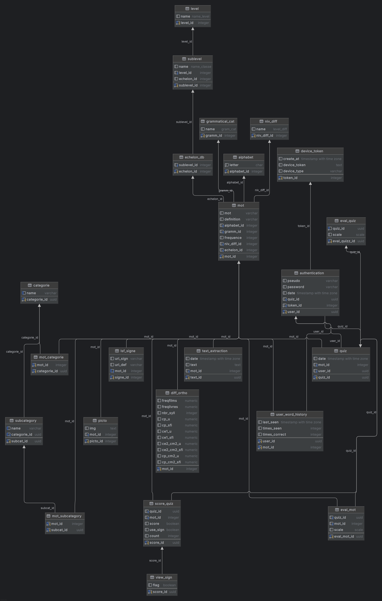

# Database Design Documentation

## Overview

The Vocabulo ML project utilizes a PostgreSQL database to store and manage data for both Vocabulo Quiz and 
Vocabulo Junior applications. This document outlines the database schema, key relationships, and design decisions.

## Database Schema

The database consists of several interconnected tables, each serving a specific purpose in the Vocabulo ecosystem. 
Below is a detailed description of each table and its relationships.

### Core Tables

#### 1. mot (Word)
This table stores information about individual words in the vocabulary learning system.

- Primary Key: `mot_id` (SERIAL)
- Fields:
  - `mot`: VARCHAR, the word itself
  - `definition`: VARCHAR, definition of the word
  - `alphabet_id`: INTEGER, foreign key to alphabet table
  - `gramm_id`: INTEGER, foreign key to grammatical_cat table
  - `frequence`: INTEGER, frequency of the word usage
  - `niv_diff_id`: INTEGER, foreign key to niv_diff table
  - `echelon_id`: INTEGER, foreign key to echelon_db table

#### 2. lsf_signe (Sign Language Sign)
Stores sign language equivalents for words or definition of words (source [Elix Dico](https://dico.elix-lsf.fr/)).

- Primary Key: `signe_id` (SERIAL)
- Fields:
  - `url_sign`: VARCHAR, URL to the sign video
  - `url_def`: VARCHAR, URL to the definition video
  - `mot_id`: INTEGER, foreign key to mot table (UNIQUE)

#### 3. categorie (Category)
Defines categories for words (example : 'Habitat', 'basique', 'aliments'...).

- Primary Key: `categorie_id` (UUID)
- Fields:
  - `name`: VARCHAR, name of the category (UNIQUE)

#### 4. subcategory
Defines subcategories within main categories ('fruits', 'légumes', 'musique' etc..).

- Primary Key: `subcat_id` (UUID)
- Fields:
  - `name`: VARCHAR, name of the subcategory
  - `categorie_id`: UUID, foreign key to categorie table

### User and Quiz Tables

#### 5. authentication
Stores user authentication information.

- Primary Key: `user_id` (UUID)
- Fields:
  - `pseudo`: VARCHAR, user's pseudonym
  - `password`: VARCHAR, user's password (hashed)
  - `date`: TIMESTAMPTZ, registration date
  - `quiz_id`: UUID, foreign key to quiz table
  - `token_id`: SERIAL, foreign key to device_token table

#### 6. quiz
- Primary Key: `quiz_id` (UUID)
- Fields:
  - `date`: TIMESTAMPTZ, date and time of the quiz
  - `mot_id`: INTEGER, foreign key to mot table
  - `user_id`: UUID, foreign key to authentication table

#### 7. score_quiz (Quiz Score)
Stores information about individual quizzes taken by users.

- Primary Key: `score_id` (UUID)
- Fields:
  - `quiz_id`: UUID, foreign key to quiz table
  - `mot_id`: INTEGER, foreign key to mot table
  - `score`: BOOLEAN, whether the answer was correct
  - `use_sign`: BOOLEAN, whether sign language was used
  - `count`: INTEGER, number of attempts

### Supplementary Tables

#### 8. alphabet
Stores individual letters of the alphabet.

- Primary Key: `alphabet_id` (INTEGER)
- Fields:
  - `letter`: CHAR, the letter

#### 9. grammatical_cat (Grammatical Category)
Defines grammatical categories for words.

- Primary Key: `gramm_id` (INTEGER)
- Fields:
  - `name`: GRAM_CAT (ENUM), name of the grammatical category

#### 10. niv_diff (Difficulty Level)
Defines difficulty levels for words ('easy', 'medium', 'hard').

- Primary Key: `niv_diff_id` (INTEGER)
- Fields:
  - `name`: LEVEL_DIFF (ENUM), name of the difficulty level

## Key Relationships

1. Words (`mot`) are central to the schema, connected to multiple tables:
   - One-to-One with `lsf_signe`
   - Many-to-Many with `categorie` through `mot_categorie`
   - Many-to-Many with `subcategory` through `mot_subcategory`

2. Users (`authentication`) are linked to their quizzes and scores:
   - One-to-Many with `quiz`
   - Indirectly to `score_quiz` through `quiz`

3. Categories and Subcategories form a hierarchy:
   - One-to-Many relationship from `categorie` to `subcategory`

## Design Decisions

1. **Use of UUIDs**: UUIDs are used for certain primary keys (e.g., `categorie`, `quiz`) to ensure uniqueness across 
distributed systems and to enhance security.

2. **Separation of Sign Language Data**: The `lsf_signe` table is separate from `mot` to allow for efficient storage 
and retrieval of sign language-specific information.

3. **Flexible Categorization**: The use of separate `categorie` and `subcategory` tables allows for a flexible and 
extensible categorization system.

4. **Quiz and Score Separation**: Keeping `quiz` and `score_quiz` as separate tables allows for more detailed tracking 
of user performance and enables future expansion of quiz-related features.

5. **Enumerated Types**: The use of ENUM types (e.g., `GRAM_CAT`, `LEVEL_DIFF`) ensures data consistency and
improves query performance for these fixed-category fields.

## Indexing Strategy

To optimize query performance, consider the following indexes:

1. `mot(mot)`: For quick word lookups
2. `authentication(pseudo)`: For user authentication
3. `quiz(user_id, date)`: For retrieving user's quiz history
4. `score_quiz(quiz_id, mot_id)`: For quick score retrieval

## Data Integrity

1. Foreign key constraints are used throughout to maintain referential integrity.
2. UNIQUE constraints on fields like `lsf_signe(mot_id)` ensure one-to-one relationships where appropriate.
3. NOT NULL constraints on critical fields prevent incomplete data entries.

## Future Considerations

1. Implement partitioning on large tables (e.g., `score_quiz`) if data volume grows significantly.
2. Consider adding full-text search capabilities for efficient word and definition searches.
3. Implement a caching layer for frequently accessed data to reduce database load.