# Deployment Documentation

## Overview

This document outlines the current deployment architecture and processes for the Vocabulo ML project, encompassing both
Vocabulo Quiz and Vocabulo Junior applications. The deployment leverages Docker containerization for consistency and ease
of management, with FastAPI serving as the API framework for each model.

## Deployment Architecture

The Vocabulo ML system is deployed using a microservices architecture with Docker containers. 
Each major component of the system runs in its own container, allowing for independent management.

### Container Structure

1. **Database Container**
   - PostgreSQL database
   - Shared between Vocabulo Quiz and Vocabulo Junior
   - With also pgAdmin picture for easy management

2. **Vocabulo Quiz Container**
   - FastAPI-based Quiz API
   - ML models for word recommendations and difficulty prediction

3. **Vocabulo Junior Container**
   - FastAPI-based Junior API
   - OCR, CamemBERT, and spaCy models

### Network Configuration

All containers are deployed on a single Docker network to ensure secure inter-container communication while maintaining 
isolation from external networks.



## Deployment Process

### Prerequisites

- Docker and Docker Compose installed on the host machine
- Environment variables configured for sensitive information

### Steps

1. Clone Repository
```
   git clone https://github.com/TessierV/vocabulo/tree/Marianne_dev/vocabulo_junior_ml 
   cd vocabulo_junior_ml
 ```
or 
```
   git clone https://github.com/TessierV/vocabulo/tree/Marianne_dev/vocabulo_quizz_ml
  cd vocabulo_quizz_ml
 ```


2. Configure Environment Variables

* Create a `.env` file with necessary configurations


3. Build Docker Images
```
docker-compose build
```

4. Start Services
```
docker-compose up -d
```

5. rebuild with dump on docker
```
docker exec -i $(docker-compose ps -q postgres) psql -U $POSTGRES_USER -d $POSTGRES_DB < lsf_app_dump.sql
```

6. Verify Deployment

* Check container status: `docker-compose ps`
* View logs: `docker-compose logs`


### API Access

* Vocabulo Quiz API is accessible at http://localhost:8000
* Vocabulo Junior API is accessible at http://localhost:8000

Each API provides specific endpoints for its respective functionality. Refer to the API documentation for details on
available routes and usage.

### Security Considerations

1. Network Security

* Use Docker's internal network for inter-container communication
* Expose only necessary ports to the host


2. Data Protection

* Use volume mounts for persistent data storage


3. Access Control

* Use environment variables for sensitive information


### Monitoring and Logging

* Currently, monitoring and logging are handled through Docker's built-in capabilities
* Use `docker-compose logs` to view application logs

### Backup and Recovery

- Regular database backups should be performed manually
- Consider implementing an automated backup solution in the future

### Troubleshooting

Common issues and their solutions:

1. Container fails to start: Check logs with `docker-compose logs [service_name]`
2. Database connection issues: Verify network config and credentials
3. API not responding: Check if the container is running and logs for any errors

### Future Considerations

1. Implement automated database backups
2. Explore container orchestration options for more robust management
3. Implement a comprehensive monitoring and alerting system
4. Consider adding a reverse proxy for enhanced security and load balancing
5. Develop a CI/CD pipeline for automated testing and deployment