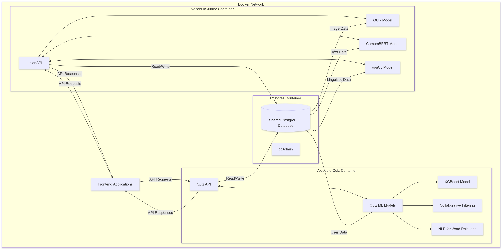

# Vocabulo ML System Overview

## Introduction

The Vocabulo ML project is an innovative language learning platform designed specifically for the deaf community. 
It comprises two main applications: Vocabulo Quiz and Vocabulo Junior. Both leverage advanced machine learning 
techniques to deliver personalized and interactive learning experiences. This document provides a comprehensive
overview of the system architecture, detailing how these applications interact with shared and individual components.

## System Architecture

Vocabulo ML is built on a microservices architecture using Docker containers. This design ensures scalability, 
maintainability, and clear separation of concerns between different system components.

### Architecture Diagram

### Key Components

#### PostgreSQL Database Container

Central data storage for both applications
Stores user profiles, vocabulary data, learning progress, quiz results, and image metadata
Ensures data consistency and enables cross-application analysis

#### Vocabulo Quiz Container

##### Quiz API:

Handles frontend requests
Manages user sessions
Coordinates interactions between frontend and ML models

##### Quiz ML Models:

XGBoost Model: Predicts word difficulty and user performance
Collaborative Filtering: Generates personalized word recommendations
NLP for Word Relations: Analyzes semantic relationships between words

#### Vocabulo Junior Container

* Junior API:

Manages requests related to image processing and word learning for younger users
Coordinates OCR and NLP tasks

* OCR Model: 

Extracts text from images uploaded by users

* CamemBERT Model: 

Provides contextual understanding of French text

* spaCy Model: 

Performs additional NLP tasks like named entity recognition and part-of-speech tagging

#### Frontend Applications

Web and mobile interfaces for both Quiz and Junior applications
Communicate with backend APIs via RESTful endpoints.
Application are design and build by 
- [Amandine Aussenat](https://github.com/Amandine4731) for Vocabulo Junior 
- [Vanessa Tessier](https://github.com/TessierV) for Vocabulo quiz 

### Data Flow

1. Users interact with frontend applications (web or mobile)
2. Frontend sends API requests to either Quiz or Junior API
3. APIs process requests, engaging appropriate ML models as needed
4. Data is retrieved from or stored in the shared PostgreSQL database
5. Processed results are returned to the frontend for user display

### Scalability and Maintenance

* Containerization allows independent scaling of each component
* Database can be scaled separately from application containers
* ML models can be updated or retrained without system-wide disruption

### Security Considerations

* All inter-container communication occurs within a secure Docker network
* API endpoints implement robust authentication and authorization
* Database access is strictly limited to application containers

### Future Expansions
The modular architecture facilitates easy integration of new features:

- Add more monitoring and logging for each container
- Additional language models for expanded linguistic support
- Real-time collaboration features for group learning
- Integration with external language resources and APIs
- Advanced analytics for deeper insights into learning patterns